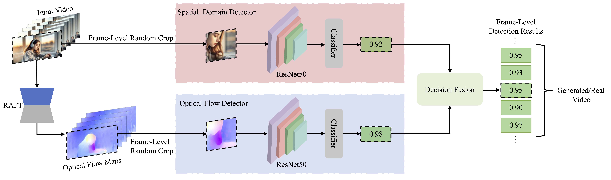

## AIGVDet
An official implementation code for paper "[AI-Generated Video Detection via Spatial-Temporal Anomaly Learning](https://arxiv.org/abs/2403.16638)", PRCV 2024. This repo will provide <B>codes, trained weights, and our training datasets</B>. 

## Network Architecture
<center>  </center>
 
## Training
- Prepare for the training datasets.
```
└─data
   ├── train
   │   └── trainset_1
   │       ├── 0_real
   │       │   ├── video_00000
   │       │   │    ├── 00000.png
   │       │   │    └── ...
   │       │   └── ...
   │       └── 1_fake
   │           ├── video_00000
   │           │    ├── 00000.png
   │           │    └── ...
   │           └── ...
   ├── val
   │   └── val_set_1
   │       ├── 0_real
   │       │   ├── video_00000
   │       │   │    ├── 00000.png
   │       │   │    └── ...
   │       │   └── ...
   │       └── 1_fake
   │           ├── video_00000
   │           │    ├── 00000.png
   │           │    └── ...
   │           └── ...
   └── test
       └── testset_1
           ├── 0_real
           │   ├── video_00000
           │   │    ├── 00000.png
           │   │    └── ...
           │   └── ...
           └── 1_fake
               ├── video_00000
               │    ├── 00000.png
               │    └── ...
               └── ...

```
- Modify configuration file in `core/utils1/config.py`.
- Train the Spatial Domain Detector with the RGB frames.
```bash
python train.py --gpus 0 --exp_name TRAIN_RGB_BRANCH datasets RGB_TRAINSET datasets_test RGB_TESTSET
```
- Train the Optical Flow Detector with the optical flow frames.
```bash
python train.py --gpus 0 --exp_name TRAIN_OF_BRANCH datasets OpticalFlow_TRAINSET datasets_test OpticalFlow_TESTSET
```
## Testing
Download the weights from [Google Drive Link](https://drive.google.com/drive/folders/18JO_YxOEqwJYfbVvy308XjoV-N6fE4yP?usp=share_link)and move it into the `checkpoints/`.

```bash
python test.py -fop PATH_TO_OPTICAL_FLOW_FRAMES -mop MODEL_PATH_TO_OPTICAL_FLOW_DETECTOR -for PATH_TO_RGB_FRAMES -mor MODEL_PATH_TO_OPTICAL_FLOW_DETECTOR -e PATH_TO_FRAME_EXCEL -ef PATH_TO_FRAME_DETECTION_RESULT_EXCEL -t THRESHOLD
```


## License 
The code and dataset is released only for academic research. Commercial usage is strictly prohibited.

## Citation
 ```
@article{AIGVDet24,
author = {Jianfa Bai and Man Lin and Gang Cao and Zijie Lou},
title = {{AI-generated video detection via spatial-temporal anomaly learning}},
conference = {The 7th Chinese Conference on Pattern Recognition and Computer Vision (PRCV)},
year = {2024},}
```

## Contact
If you have any questions, please contact me(jianfa@cuc.edu.cn or lyan924@cuc.edu.cn).


